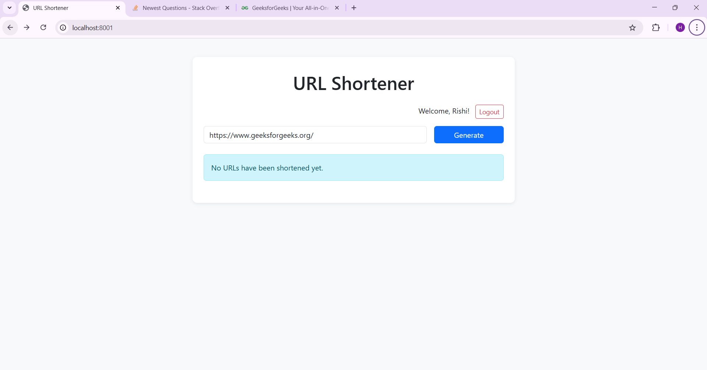
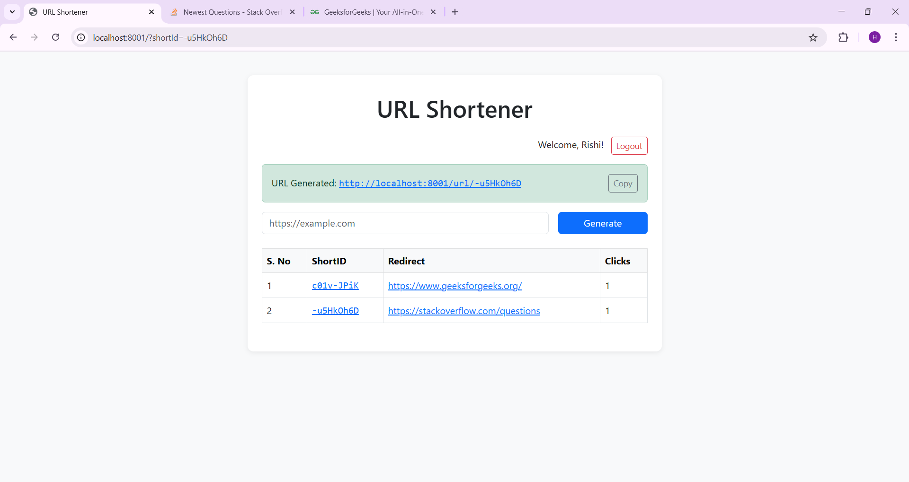

# 🔗 URL Shortener

A full-stack URL shortener web application built using **Node.js**, **Express**, **MongoDB**, **EJS**, and **Bootstrap**. Authenticated users can generate and manage short URLs, track click analytics, generate QR codes, and more — all in a clean, responsive interface.

## 🚀 Features

- ✅ **User Signup & Login** - Session-based Authentication with bcrypt password hashing
- 🔐 **Route Protection** - Middleware-based authentication and authorization
- ✂️ **URL Shortening** - Generate unique short links using nanoid/shortid
- 📊 **Click Analytics** - Track clicks with timestamps and visit history
- � **QR Code Generation** - Generate QR codes for shortened URLs
- ⏰ **Link Expiration** - Set expiry dates for short URLs
- � **Link Preview** - Preview destination URL before redirecting
- � **Copy to Clipboard** - One-click copy feature for generated short URLs
- 🛡️ **Rate Limiting** - Prevent abuse with express-rate-limit
- 📱 **Responsive UI** - Modern Bootstrap 5 design with gradients and animations

## 📸 Screenshots

| Home Page (Logged In) | Short URL Copy Feature |
|-----------------------|------------------------|
|  |  |

## 🛠️ Tech Stack

| Tech              | Role                           |
|-------------------|--------------------------------|
| **Node.js**       | Backend runtime                |
| **Express.js v5** | Web framework                  |
| **MongoDB**       | NoSQL Database                 |
| **Mongoose**      | MongoDB ODM                    |
| **EJS**           | Templating engine              |
| **Bootstrap 5**   | Responsive styling             |
| **nanoid/shortid**| Unique short URL generator     |
| **bcrypt**        | Password hashing               |
| **cookie-parser** | Cookie-based session auth      |
| **qrcode**        | QR code generation             |
| **express-rate-limit** | Rate limiting middleware  |
| **nodemailer**    | Email functionality            |
| **dotenv**        | Environment variables          |

## 📂 Project Structure

```
.
├── controllers/
│   ├── url.js          # URL shortening logic
│   └── user.js         # User authentication logic
├── middlewares/
│   ├── auth.js         # Authentication middleware
│   └── rateLimiter.js  # Rate limiting middleware
├── models/
│   ├── url.js          # URL schema with expiry & visit history
│   └── user.js         # User schema with password hashing
├── routes/
│   ├── url.js          # URL API routes
│   ├── user.js         # User authentication routes
│   └── staticRouter.js # Static page routes
├── service/
│   └── auth.js         # JWT/session token service
├── views/
│   ├── home.ejs        # Dashboard with URL management
│   ├── landing.ejs     # Landing page for unauthenticated users
│   ├── login.ejs       # Login page
│   └── signup.ejs      # Signup page
├── public/             # Static assets (CSS, images)
├── screenshots/        # Application screenshots
├── api/                # Serverless API handler
├── app.js              # Express app configuration
├── index.js            # Server entry point
├── connect.js          # MongoDB connection setup
├── vercel.json         # Vercel deployment config
├── package.json        # Dependencies and scripts
└── README.md           # Project documentation
```

## 🚀 Getting Started

### Prerequisites

- Node.js (v18+)
- MongoDB (local or Atlas)
- npm or yarn

### Installation

1. **Clone the repository**
   ```bash
   git clone https://github.com/githubrishi321/url-shortener.git
   cd url-shortener
   ```

2. **Install dependencies**
   ```bash
   npm install
   ```

3. **Set up environment variables**
   
   Create a `.env` file in the root directory:
   ```env
   MONGODB_URI=mongodb+srv://your-connection-string
   SECRET=your-jwt-secret-key
   PORT=8001
   ```

4. **Run the application**
   ```bash
   # Development mode
   npm run dev
   
   # Production mode
   npm start
   ```

5. **Open in browser**
   ```
   http://localhost:8001
   ```

## 📡 API Endpoints

| Method | Endpoint       | Description                    | Auth Required |
|--------|----------------|--------------------------------|---------------|
| POST   | `/url/`        | Create a new short URL         | ✅            |
| GET    | `/:shortId`    | Redirect to original URL       | ❌            |
| GET    | `/:shortId?preview=1` | Preview destination URL | ❌            |
| POST   | `/user/signup` | Register a new user            | ❌            |
| POST   | `/user/login`  | Login and get session token    | ❌            |
| GET    | `/user/logout` | Logout and clear session       | ✅            |

## 🔐 Security Features

- **Password Hashing** - bcrypt with salt rounds
- **Session-based Auth** - Secure cookie tokens
- **Rate Limiting** - Prevents brute-force attacks
- **Link Expiration** - URLs can expire after set time
- **Input Validation** - URL format validation

## 🌐 Deployment

This project is configured for **Vercel** deployment with `vercel.json` and serverless functions.

```bash
# Deploy to Vercel
vercel --prod
```

## 👨‍💻 Author

**Rishi** - [GitHub](https://github.com/githubrishi321)

## 📝 License

This project is licensed under the ISC License.

---

⭐ **If you found this project helpful, please give it a star!**
